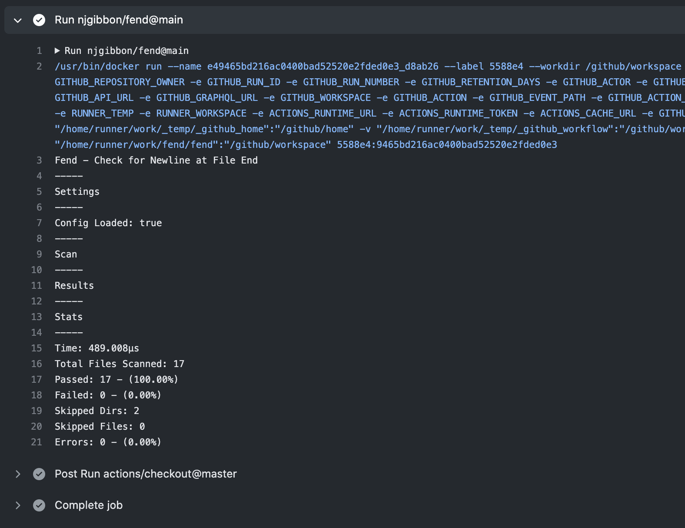
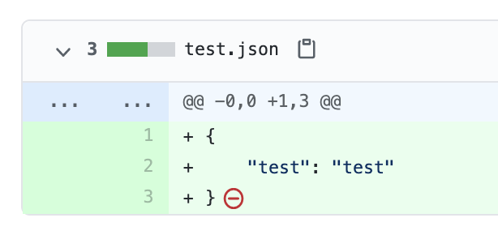
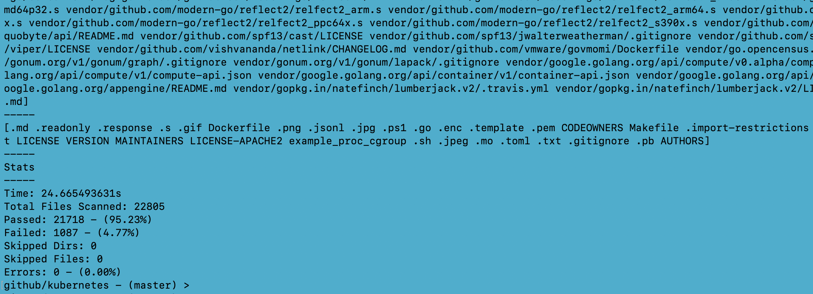

# fend
Check for Newline at **F**ile **End**

Fend recursively scans all files in a directory and reports those that don't end in a new line character (`\n`).



# Why might you want to do this?

It is a POSIX Standard that you *should*, *arguably* adhere to.

This StackOverflow post captures the *why?* better than I could:

https://stackoverflow.com/questions/729692/why-should-text-files-end-with-a-newline

It will mean no more GitHub warnings for 'No newline at EOF' on Pull Request.



By enforcing this check using the GitHub Action you can automate a basic Standard in your project.

Consistent is clean. Clean is good. Don't overthink it. :ok_hand:

# GitHub Action
See [.github/workflows/fend.yaml](.github/workflows/fend.yaml) as the Action is run on this repository!

See [Configuration](#Configuration) for additonal options.
```
jobs:
  fend:
    runs-on: ubuntu-latest
    steps:
    - uses: actions/checkout@master
    - uses: njgibbon/fend@main
```
**That's all!** :dizzy:

# Research
Running Fend on some well known repositories and recording the results!

[docs/research/readme.md](docs/research/readme.md).

# Details
* Fend always ignores all '.git' directories and non-regular files like symlinks. 
* To skip anything else see [Configuration](#Configuration). You will want to configure the tool to skip any binary file types found in your repository - like any images for instance.


# Usage
```
go get -u github.com/njgibbon/fend/cmd/fend
# ensure binary can be found in $PATH e.g
# mv ~/go/bin/fend ~/my/bin
cd <dir-to-scan>
fend
```
**Other**
```
# Version of fend
fend version
# Doc command points to here
fend doc
```
## Package
The scanner component can easily be used as a package. 
See [cmd/fend/main.go](cmd/fend/main.go) and [pkg/scanner/scanner_test.go](pkg/scanner/scanner_test.go) for usage examples.

# Configuration
Place a file called `.fend.yaml` in the working directory to configure your scan. See [.fend.yaml](.fend.yaml) for the configuration used for the fend GitHub Action on *this* repository.
```
skip:
  file: 
    - skip_file.txt
  file_all: 
    - skip_file_all.txt
  dir:
    - skip-dir
  dir_all:
    - skip-dir-all
  extension: 
    - .skip
    - .ignore
```
* You can skip specific files or directories by providing the full path.
* You can skip all instances of a file or directory.
* You can skip all files with certain extensions.
The Failure Extensions Feature can be used to help you configure a good skip list. See [docs/research/checkov/readme.md](docs/research/checkov/readme.md) for an example of how you can quickly configure the right skips.

# Failed Scan Example


# Meta
Project used as a vehicle to help learn some of the basics of tool development using Go and also to explore GitHub Actions from a development point of view as I have had a really positive experience with GitHub Actions from the user perspective.

# Similar tools
* https://github.com/fernandrone/linelint
